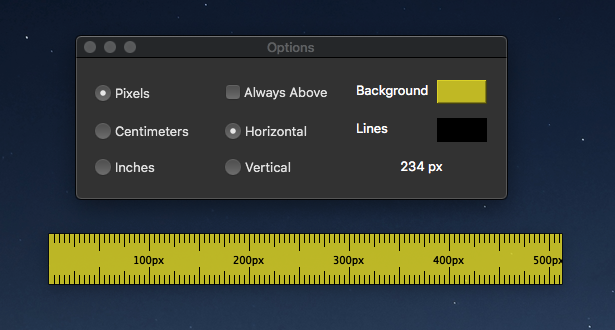

# Screen Ruler

## Units

The ruler is accurate for pixels (since that's how its drawn), but for the remaining units, its not 100% accurate.

This happens since you sometimes need a line in between two pixels (which isn't possible, a pixel is the smallest unit possible). Therefore you'll see some lines not perfectly separated (since the proper position would be in between two pixels).

In the options window, there's a label that shows the distance from the origin of the ruler to where the mouse is. That's probably a better way to measure.

# Installation

## Homebrew

-   `brew tap drk4/homebrew-tap https://bitbucket.org/drk4/homebrew-tap/`
-   `brew install screen_ruler`

## setup.py

-   `python3 setup.py install`

Then run from the terminal with the command `screen_ruler`.

## Dependencies

-   [Python3](http://python.org)
-   [PySide2](https://wiki.qt.io/Qt_for_Python)

`pip3 install -r requirements.txt` or `brew install pyside`

# Keyboard shortcuts

Ruler window:

-   alt + ( o )ptions --> open the options window
-   alt + ( r )otate --> rotate the ruler window

Options/about window:

-   esc key --> closes the window
